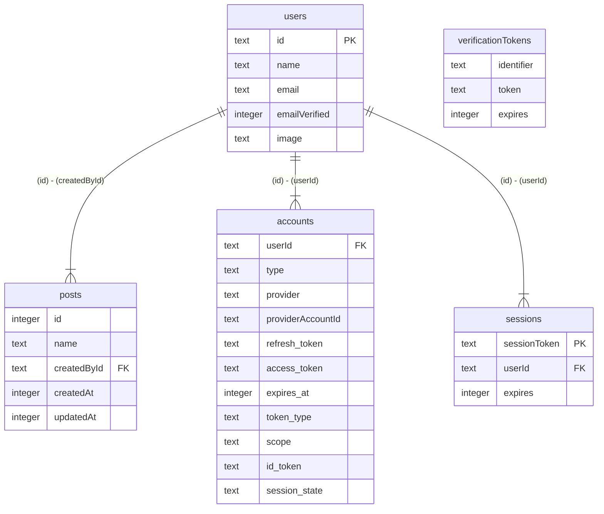

```mermaid
erDiagram
    users ||--|{ posts : "(id) - (createdById)"
    users ||--|{ accounts : "(id) - (userId)"
    users ||--|{ sessions : "(id) - (userId)"
    posts {
        integer id
        text name
        text createdById FK
        integer createdAt
        integer updatedAt
    }
    users {
        text id PK
        text name
        text email
        integer emailVerified
        text image
    }
    accounts {
        text userId FK
        text type
        text provider
        text providerAccountId
        text refresh_token
        text access_token
        integer expires_at
        text token_type
        text scope
        text id_token
        text session_state
    }
    sessions {
        text sessionToken PK
        text userId FK
        integer expires
    }
    verificationTokens {
        text identifier
        text token
        integer expires
    }
```
