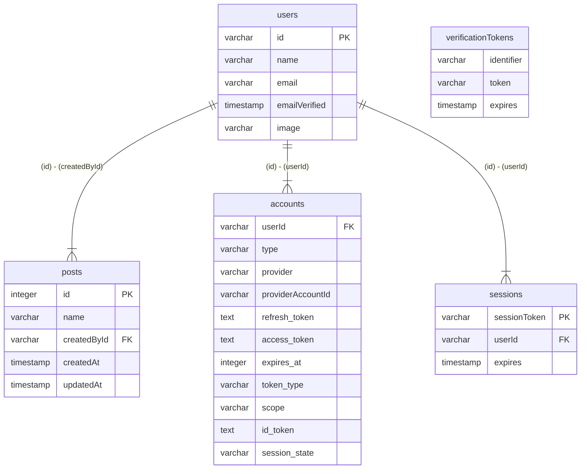

```mermaid
erDiagram
    users ||--|{ posts : "(id) - (createdById)"
    users ||--|{ accounts : "(id) - (userId)"
    users ||--|{ sessions : "(id) - (userId)"
    posts {
        integer id PK
        varchar name
        varchar createdById FK
        timestamp createdAt
        timestamp updatedAt
    }
    users {
        varchar id PK
        varchar name
        varchar email
        timestamp emailVerified
        varchar image
    }
    accounts {
        varchar userId FK
        varchar type
        varchar provider
        varchar providerAccountId
        text refresh_token
        text access_token
        integer expires_at
        varchar token_type
        varchar scope
        text id_token
        varchar session_state
    }
    sessions {
        varchar sessionToken PK
        varchar userId FK
        timestamp expires
    }
    verificationTokens {
        varchar identifier
        varchar token
        timestamp expires
    }
```
