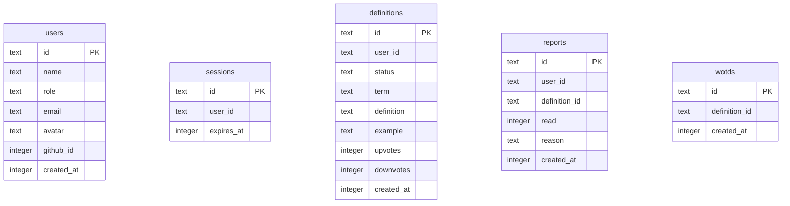

```mermaid
erDiagram
    users {
        text id PK
        text name
        text role
        text email
        text avatar
        integer github_id
        integer created_at
    }
    sessions {
        text id PK
        text user_id
        integer expires_at
    }
    definitions {
        text id PK
        text user_id
        text status
        text term
        text definition
        text example
        integer upvotes
        integer downvotes
        integer created_at
    }
    reports {
        text id PK
        text user_id
        text definition_id
        integer read
        text reason
        integer created_at
    }
    wotds {
        text id PK
        text definition_id
        integer created_at
    }
```
