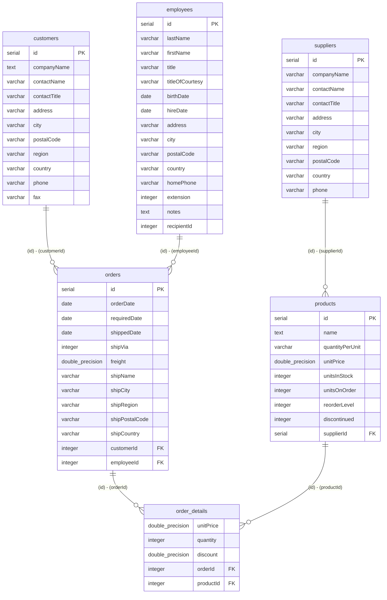

```mermaid
erDiagram
    customers ||--o{ orders : "(id) - (customerId)"
    employees ||--o{ orders : "(id) - (employeeId)"
    suppliers ||--o{ products : "(id) - (supplierId)"
    orders ||--o{ order_details : "(id) - (orderId)"
    products ||--o{ order_details : "(id) - (productId)"
    customers {
        serial id PK
        text companyName
        varchar contactName
        varchar contactTitle
        varchar address
        varchar city
        varchar postalCode
        varchar region
        varchar country
        varchar phone
        varchar fax
    }
    employees {
        serial id PK
        varchar lastName
        varchar firstName
        varchar title
        varchar titleOfCourtesy
        date birthDate
        date hireDate
        varchar address
        varchar city
        varchar postalCode
        varchar country
        varchar homePhone
        integer extension
        text notes
        integer recipientId
    }
    orders {
        serial id PK
        date orderDate
        date requiredDate
        date shippedDate
        integer shipVia
        double_precision freight
        varchar shipName
        varchar shipCity
        varchar shipRegion
        varchar shipPostalCode
        varchar shipCountry
        integer customerId FK
        integer employeeId FK
    }
    suppliers {
        serial id PK
        varchar companyName
        varchar contactName
        varchar contactTitle
        varchar address
        varchar city
        varchar region
        varchar postalCode
        varchar country
        varchar phone
    }
    products {
        serial id PK
        text name
        varchar quantityPerUnit
        double_precision unitPrice
        integer unitsInStock
        integer unitsOnOrder
        integer reorderLevel
        integer discontinued
        serial supplierId FK
    }
    order_details {
        double_precision unitPrice
        integer quantity
        double_precision discount
        integer orderId FK
        integer productId FK
    }
```
