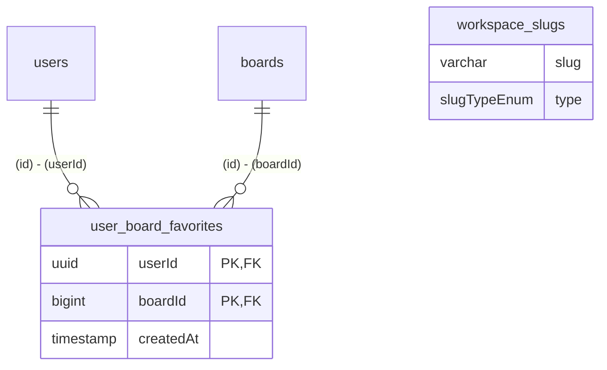

```mermaid
erDiagram
    users ||--o{ user_board_favorites : "(id) - (userId)"
    boards ||--o{ user_board_favorites : "(id) - (boardId)"
    user_board_favorites {
        uuid userId PK, FK
        bigint boardId PK, FK
        timestamp createdAt
    }
    workspace_slugs {
        varchar slug
        slugTypeEnum type
    }
```
