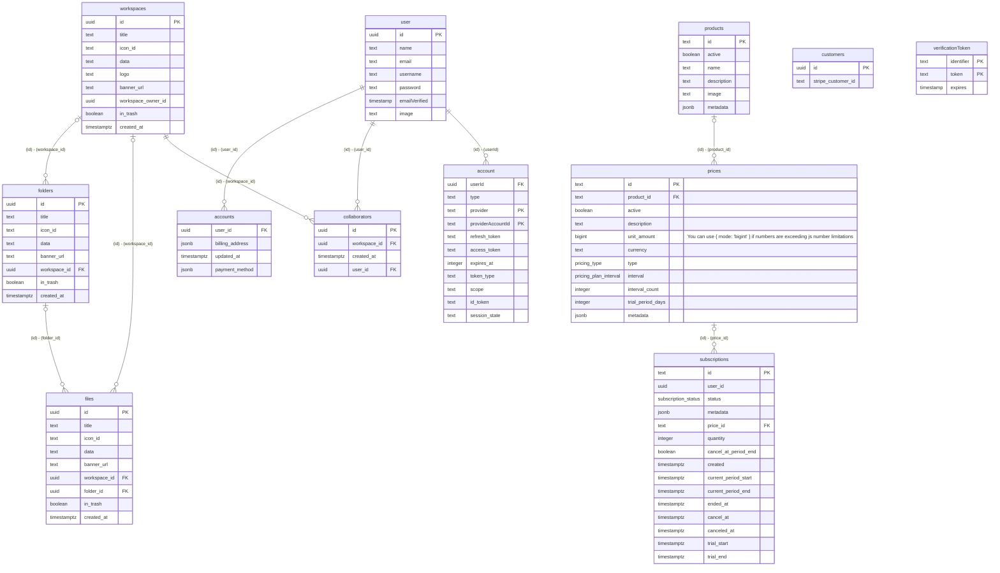

```mermaid
erDiagram
    workspaces |o--o{ folders : "(id) - (workspace_id)"
    workspaces |o--o{ files : "(id) - (workspace_id)"
    folders |o--o{ files : "(id) - (folder_id)"
    user ||--o{ accounts : "(id) - (user_id)"
    products |o--o{ prices : "(id) - (product_id)"
    prices |o--o{ subscriptions : "(id) - (price_id)"
    workspaces ||--o{ collaborators : "(id) - (workspace_id)"
    user ||--o{ collaborators : "(id) - (user_id)"
    user ||--o{ account : "(id) - (userId)"
    workspaces {
        uuid id PK
        text title
        text icon_id
        text data
        text logo
        text banner_url
        uuid workspace_owner_id
        boolean in_trash
        timestamptz created_at
    }
    folders {
        uuid id PK
        text title
        text icon_id
        text data
        text banner_url
        uuid workspace_id FK
        boolean in_trash
        timestamptz created_at
    }
    files {
        uuid id PK
        text title
        text icon_id
        text data
        text banner_url
        uuid workspace_id FK
        uuid folder_id FK
        boolean in_trash
        timestamptz created_at
    }
    accounts {
        uuid user_id FK
        jsonb billing_address
        timestamptz updated_at
        jsonb payment_method
    }
    customers {
        uuid id PK
        text stripe_customer_id
    }
    prices {
        text id PK
        text product_id FK
        boolean active
        text description
        bigint unit_amount "You can use { mode: 'bigint' } if numbers are exceeding js number limitations"
        text currency
        pricing_type type
        pricing_plan_interval interval
        integer interval_count
        integer trial_period_days
        jsonb metadata
    }
    products {
        text id PK
        boolean active
        text name
        text description
        text image
        jsonb metadata
    }
    subscriptions {
        text id PK
        uuid user_id
        subscription_status status
        jsonb metadata
        text price_id FK
        integer quantity
        boolean cancel_at_period_end
        timestamptz created
        timestamptz current_period_start
        timestamptz current_period_end
        timestamptz ended_at
        timestamptz cancel_at
        timestamptz canceled_at
        timestamptz trial_start
        timestamptz trial_end
    }
    collaborators {
        uuid id PK
        uuid workspace_id FK
        timestamptz created_at
        uuid user_id FK
    }
    user {
        uuid id PK
        text name
        text email
        text username
        text password
        timestamp emailVerified
        text image
    }
    account {
        uuid userId FK
        text type
        text provider PK
        text providerAccountId PK
        text refresh_token
        text access_token
        integer expires_at
        text token_type
        text scope
        text id_token
        text session_state
    }
    verificationToken {
        text identifier PK
        text token PK
        timestamp expires
    }
```
