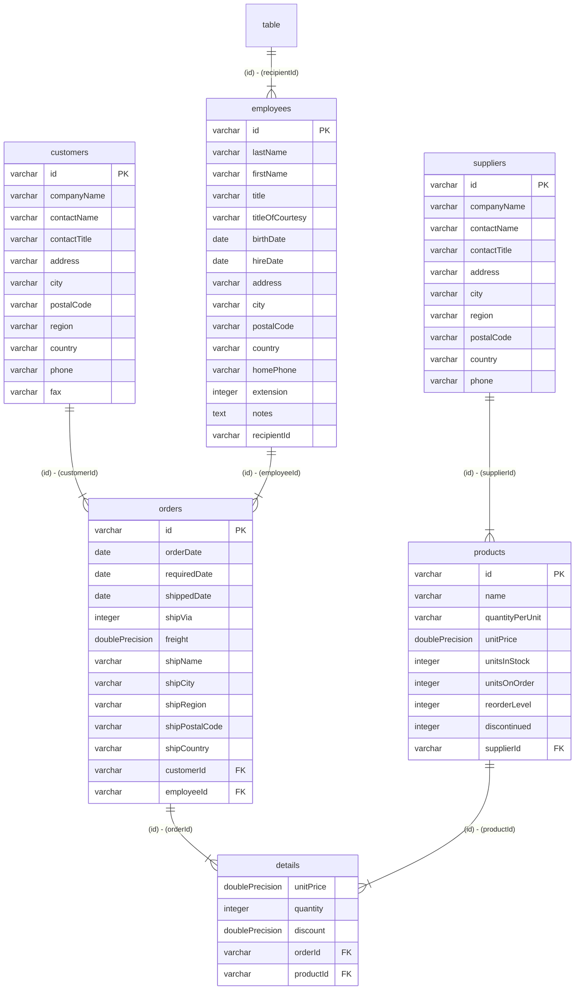

```mermaid
erDiagram
    table ||--|{ employees : "(id) - (recipientId)"
    customers ||--|{ orders : "(id) - (customerId)"
    employees ||--|{ orders : "(id) - (employeeId)"
    suppliers ||--|{ products : "(id) - (supplierId)"
    orders ||--|{ details : "(id) - (orderId)"
    products ||--|{ details : "(id) - (productId)"
    customers {
        varchar id PK
        varchar companyName
        varchar contactName
        varchar contactTitle
        varchar address
        varchar city
        varchar postalCode
        varchar region
        varchar country
        varchar phone
        varchar fax
    }
    employees {
        varchar id PK
        varchar lastName
        varchar firstName
        varchar title
        varchar titleOfCourtesy
        date birthDate
        date hireDate
        varchar address
        varchar city
        varchar postalCode
        varchar country
        varchar homePhone
        integer extension
        text notes
        varchar recipientId
    }
    orders {
        varchar id PK
        date orderDate
        date requiredDate
        date shippedDate
        integer shipVia
        doublePrecision freight
        varchar shipName
        varchar shipCity
        varchar shipRegion
        varchar shipPostalCode
        varchar shipCountry
        varchar customerId FK
        varchar employeeId FK
    }
    suppliers {
        varchar id PK
        varchar companyName
        varchar contactName
        varchar contactTitle
        varchar address
        varchar city
        varchar region
        varchar postalCode
        varchar country
        varchar phone
    }
    products {
        varchar id PK
        varchar name
        varchar quantityPerUnit
        doublePrecision unitPrice
        integer unitsInStock
        integer unitsOnOrder
        integer reorderLevel
        integer discontinued
        varchar supplierId FK
    }
    details {
        doublePrecision unitPrice
        integer quantity
        doublePrecision discount
        varchar orderId FK
        varchar productId FK
    }
```
