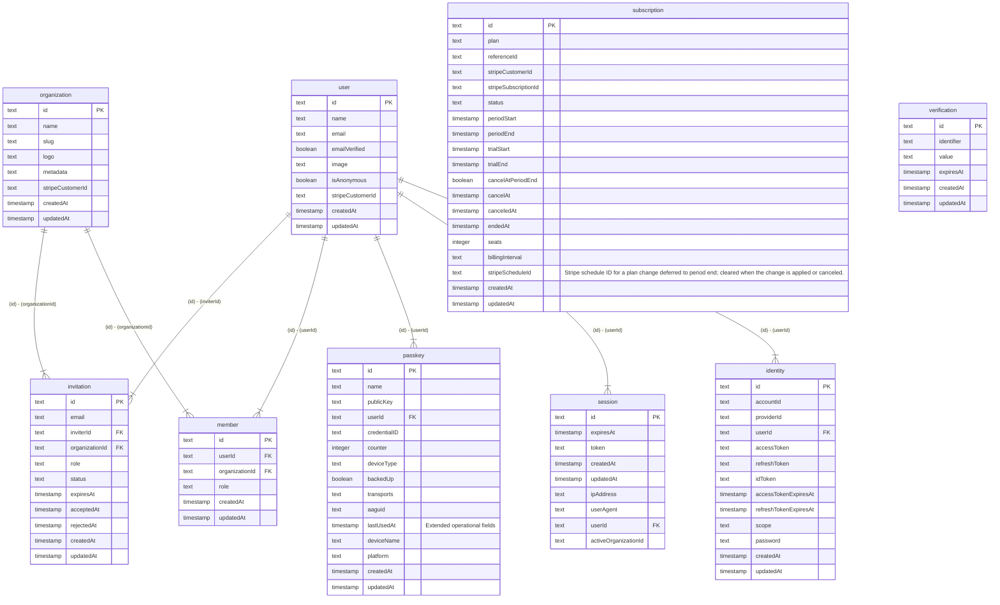

```mermaid
erDiagram
    user ||--|{ invitation : "(id) - (inviterId)"
    organization ||--|{ invitation : "(id) - (organizationId)"
    user ||--|{ member : "(id) - (userId)"
    organization ||--|{ member : "(id) - (organizationId)"
    user ||--|{ passkey : "(id) - (userId)"
    user ||--|{ session : "(id) - (userId)"
    user ||--|{ identity : "(id) - (userId)"
    invitation {
        text id PK
        text email
        text inviterId FK
        text organizationId FK
        text role
        text status
        timestamp expiresAt
        timestamp acceptedAt
        timestamp rejectedAt
        timestamp createdAt
        timestamp updatedAt
    }
    organization {
        text id PK
        text name
        text slug
        text logo
        text metadata
        text stripeCustomerId
        timestamp createdAt
        timestamp updatedAt
    }
    member {
        text id PK
        text userId FK
        text organizationId FK
        text role
        timestamp createdAt
        timestamp updatedAt
    }
    passkey {
        text id PK
        text name
        text publicKey
        text userId FK
        text credentialID
        integer counter
        text deviceType
        boolean backedUp
        text transports
        text aaguid
        timestamp lastUsedAt "Extended operational fields"
        text deviceName
        text platform
        timestamp createdAt
        timestamp updatedAt
    }
    subscription {
        text id PK
        text plan
        text referenceId
        text stripeCustomerId
        text stripeSubscriptionId
        text status
        timestamp periodStart
        timestamp periodEnd
        timestamp trialStart
        timestamp trialEnd
        boolean cancelAtPeriodEnd
        timestamp cancelAt
        timestamp canceledAt
        timestamp endedAt
        integer seats
        text billingInterval
        text stripeScheduleId "Stripe schedule ID for a plan change deferred to period end; cleared when the change is applied or canceled."
        timestamp createdAt
        timestamp updatedAt
    }
    user {
        text id PK
        text name
        text email
        boolean emailVerified
        text image
        boolean isAnonymous
        text stripeCustomerId
        timestamp createdAt
        timestamp updatedAt
    }
    session {
        text id PK
        timestamp expiresAt
        text token
        timestamp createdAt
        timestamp updatedAt
        text ipAddress
        text userAgent
        text userId FK
        text activeOrganizationId
    }
    identity {
        text id PK
        text accountId
        text providerId
        text userId FK
        text accessToken
        text refreshToken
        text idToken
        timestamp accessTokenExpiresAt
        timestamp refreshTokenExpiresAt
        text scope
        text password
        timestamp createdAt
        timestamp updatedAt
    }
    verification {
        text id PK
        text identifier
        text value
        timestamp expiresAt
        timestamp createdAt
        timestamp updatedAt
    }
```
