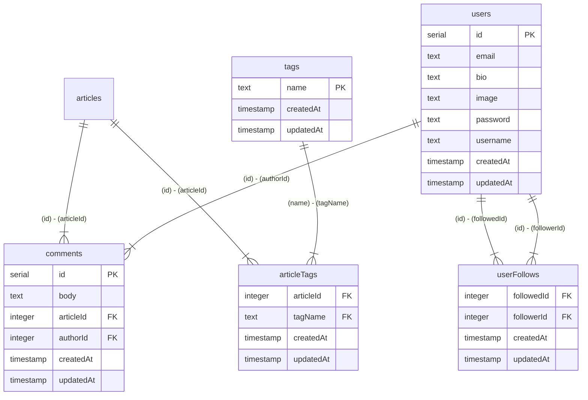

```mermaid
erDiagram
    articles ||--|{ comments : "(id) - (articleId)"
    users ||--|{ comments : "(id) - (authorId)"
    articles ||--|{ articleTags : "(id) - (articleId)"
    tags ||--|{ articleTags : "(name) - (tagName)"
    users ||--|{ userFollows : "(id) - (followedId)"
    users ||--|{ userFollows : "(id) - (followerId)"
    comments {
        serial id PK
        text body
        integer articleId FK
        integer authorId FK
        timestamp createdAt
        timestamp updatedAt
    }
    tags {
        text name PK
        timestamp createdAt
        timestamp updatedAt
    }
    articleTags {
        integer articleId FK
        text tagName FK
        timestamp createdAt
        timestamp updatedAt
    }
    users {
        serial id PK
        text email
        text bio
        text image
        text password
        text username
        timestamp createdAt
        timestamp updatedAt
    }
    userFollows {
        integer followedId FK
        integer followerId FK
        timestamp createdAt
        timestamp updatedAt
    }
```
